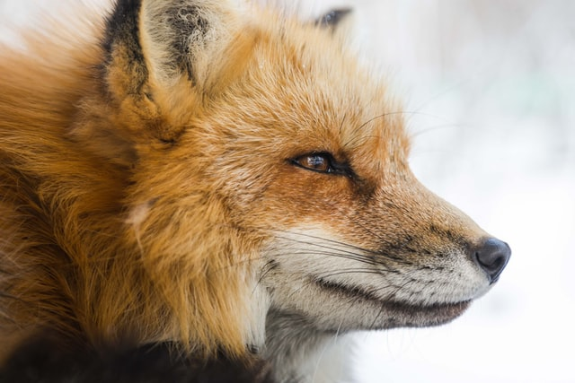

Inserting image is similar to linking, just use `!` before `[]` which stands for alt (maybe empty), and then `()` where you place source and "title" if needs.

[pup]: http://picsum.photos/id/237/300/200

Or you can use reference same as in link, ex. _pup_ image  
![Pup image][pup]
and put value of your ref before or after this peace of text.

You can use nested markdown to put link for larger image  

Or use html inside  

In markdown you can use html tags and even style for css wherever you can't control  
  

?Styling not working

You write use figure and figcaption in html

<figure>
  

  <figcaption>
    Fox image figcaption
  </figcaption>
</figure>

